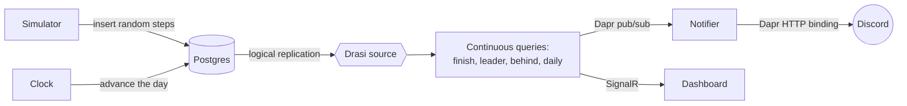

# StepUp

[](https://github.com/willvelida/step-challenge/actions/workflows/ci.yml)
[](https://github.com/willvelida/step-challenge/actions/workflows/deploy.yml)
[](LICENSE)

A sample application that shows [Dapr](https://dapr.io), [Radius](https://radapp.io), and
[Drasi](https://drasi.io) working together in one app.

StepUp is a step-count challenge for a group of friends: a simulator invents the step data,
and **Drasi** continuously watches the database and detects "contests" as they happen — who
finished first, who just took the lead, who has fallen behind pace, who smashed today's
goal. Those moments surface live to a **Discord** channel and a web **dashboard**.

It runs entirely on **randomly generated data** — no real step tracking — so you can start a
contest with any number of participants and watch a full 30-day challenge play out in a few
minutes on an accelerated clock.

## Architecture



When the simulator writes steps or the clock advances a day, Drasi re-evaluates its queries
against just that change and pushes the differences onward — no polling anywhere.

## Services

| Service     | Stack         | Role                                                      |
|-------------|---------------|----------------------------------------------------------|
| `simulator` | .NET 10       | Generates random step data; starts and deletes contests  |
| `clock`     | .NET 10       | Advances the challenge day on an accelerated schedule    |
| `notifier`  | .NET 10       | Subscribes to contest events and posts them to Discord   |
| `dashboard` | Vue 3 + nginx | Live leaderboard and contest controls over SignalR       |
| Postgres    | postgres:16   | Step data with logical replication for Drasi             |
| Redis       | redis:7       | Shared Dapr pub/sub broker for Drasi and the notifier    |

## How Dapr, Radius, and Drasi work together

The three technologies each own a distinct job, and the app is interesting precisely
because of where they meet.

### Dapr — the wiring between services

Every .NET service runs with a [Dapr](https://dapr.io) sidecar, and the app leans on four
Dapr building blocks instead of hand-rolling integrations:

- **Cron input bindings** drive the simulation: `ticker` calls the simulator every 5s, `clock-cron` calls the clock every 60s.
- **Pub/sub over Redis** (`stepup-pubsub`) carries contest events — Drasi's reaction publishes, the notifier subscribes.
- An **HTTP output binding** (`discord`) posts to the Discord webhook, with the URL read from a Kubernetes secret via Dapr's **secret store**.

Components live in `components/` for the self-hosted local runs, and as `dapr.io/Component`
resources inside `infra/app.bicep` for the in-cluster deployment.

### Radius — the application model

[Radius](https://radapp.io) describes the whole app as one deployable unit. `infra/app.bicep`
defines the four service containers, their Dapr sidecars and components, and the in-cluster
Postgres — all deployed together with a single `rad deploy`. The image registry and tag are
parameters, so the same definition runs locally on kind and on Azure against ACR. The Radius
Bicep extension is configured in `infra/bicepconfig.json`.

### Drasi — the change-driven mechanism

[Drasi](https://drasi.io) is what turns raw database writes into contests:

- A PostgreSQL **source** (`drasi/source.yaml`) reads Postgres over logical replication.
- Five **continuous queries** (`drasi/*.yaml`) express the contests — race-to-goal, new-leader, behind-pace, daily-smashed, and collective-progress.
- Three **reactions** fan the results out: a debug reaction for development, a Dapr pub/sub reaction to the notifier, and a SignalR reaction to the dashboard.

Queries are incremental — Drasi maintains each result set and emits only the adds, updates,
and removes as the data changes, so nothing polls.

Radius deploys and wires the app, Dapr moves the messages and bindings
between services, and Drasi detects the contests that drive Discord and the dashboard.

## Run it locally

Everything runs on a local [kind](https://kind.sigs.k8s.io) cluster backed by Docker Desktop.

### Prerequisites

- **Docker Desktop**, running.
- These CLIs on your `PATH`: `kind`, `kubectl`, `rad` ([Radius](https://docs.radapp.io/installation/)), `drasi` ([Drasi](https://drasi.io)), `docker`, plus the **.NET 10 SDK**.
- A one-time Radius environment: run `rad init` once (the script expects the `default` environment).
- A **Discord webhook URL** — `cluster-up.sh` needs one. Either `export DISCORD_WEBHOOK_URL=...` or put it in `src/Notifier/secrets.json` (gitignored). You could also use Slack as an alternative.

### Spin it up

```bash
./scripts/cluster-up.sh
```

This creates the kind cluster, installs Dapr + Drasi + Radius, builds and side-loads the four
service images, deploys the app with `rad deploy`, and applies the Drasi source, queries, and
reactions. Tear it down with:

```bash
./scripts/cluster-down.sh          # remove the app, keep the cluster + control planes
./scripts/cluster-down.sh --all    # delete the whole kind cluster
```

### Starting the UI

```bash
kubectl port-forward -n default-stepup deploy/dashboard 9091:80
drasi tunnel reaction dashboard 8080      # in a second terminal
```

Open <http://localhost:9091>, choose a participant count, and **Start a contest**. Steps tick
in every few seconds and the simulated day advances every minute, so a full 30-day challenge
plays out in about half an hour.

### Just the database (service development)

To iterate on a single .NET service without a cluster, run Postgres on its own (uses podman):

```bash
./scripts/db-up.sh        # add --fresh to wipe the volume
./scripts/db-down.sh
```

Then run a service with `dotnet run` against `localhost:5432` (its `PG_DSN` default).

## Deploy to your own Azure subscription

Two paths deploy the same Bicep infrastructure and Radius app onto AKS + ACR: let the
GitHub Actions pipeline do it (recommended), or run the steps yourself with the az CLI.

### One-time bootstrap (OIDC)

Fork the repo, then from a clone:

```bash
az login
gh auth login
# Edit infra/github-oidc.bicepparam  (your GitHub org/repo)
#  and  infra/main.bicepparam        (acrName must be globally unique)
DISCORD_WEBHOOK_URL='https://discord.com/api/webhooks/...' ./scripts/setup-oidc.sh
```

`setup-oidc.sh` creates a passwordless **OIDC identity** (federated credentials scoped to your
repo), grants it the roles the pipeline needs, and writes the GitHub **variables** and the
Discord **secret** the workflows read — no long-lived credentials are ever stored.

### Path A — the pipeline (recommended)

Push to `main`, or run the **Deploy** workflow manually from the Actions tab. It runs two jobs:

- **infra** — provisions the resource group, AKS, and ACR from `infra/main.bicep`, and grants the deploy identity push/admin roles.
- **deploy** — builds and pushes the images (tagged by commit SHA), then `rad deploy`s the app and applies the Drasi source, queries, and reactions.

Pull requests trigger **CI** instead — it builds the images and lints the Bicep, with no deploy.

### Path B — the az CLI (manual)

The one-shot script wraps the whole sequence:

```bash
az login
./scripts/aks-up.sh               # provision -> build/push -> deploy -> Drasi apply
./scripts/aks-down.sh             # stop the cluster (az aks stop)
./scripts/aks-down.sh --destroy   # delete the resource group entirely
```

Or run the pieces by hand:

1. Provision the infrastructure: `az deployment sub create -n stepup -l <region> --parameters infra/main.bicepparam`
2. Build and push each service image: `az acr build -r <acr> -t <service>:<tag> --platform linux/amd64 src/<Service>`
3. Deploy the app: `rad deploy infra/app.bicep --parameters imageRegistry=<acr>.azurecr.io --parameters imageTag=<tag>`
4. Apply Drasi: `drasi apply -f drasi/source.yaml`, then the queries and reactions in `drasi/`

### Configuration the workflows read

`setup-oidc.sh` sets all of these; listed so you know what's there.

| Kind     | Name                                                     | Purpose                          |
|----------|----------------------------------------------------------|----------------------------------|
| Variable | `AZURE_CLIENT_ID`, `AZURE_TENANT_ID`, `AZURE_SUBSCRIPTION_ID` | OIDC login to Azure          |
| Variable | `IDENTITY_NAME`, `IDENTITY_RG`                            | the OIDC managed identity        |
| Variable | `APP_RG`, `ACR_NAME`, `AKS_NAME`, `LOCATION`             | where the app deploys            |
| Secret   | `DISCORD_WEBHOOK_URL`                                     | the notifier's Discord webhook   |

### Keep costs down

StepUp uses the **Free** AKS control-plane tier and a small node pool, but the nodes still bill
while running. Stop the cluster when you're not using it, and check current pricing for your
region before leaving anything up:

```bash
az aks stop -g stepup-rg -n stepup-aks        # or ./scripts/aks-down.sh
./scripts/aks-down.sh --destroy               # remove everything
```

## Contributing

Contributions are welcome — bug fixes, new contests, documentation, or deployment
improvements. Fork the repo, branch off `main`, and open a pull request; CI (image build +
Bicep lint) must pass before merge. See [CONTRIBUTING.md](CONTRIBUTING.md) for the full
workflow, commit conventions, and a map of where things live.

## License

Licensed under the [MIT License](LICENSE).
